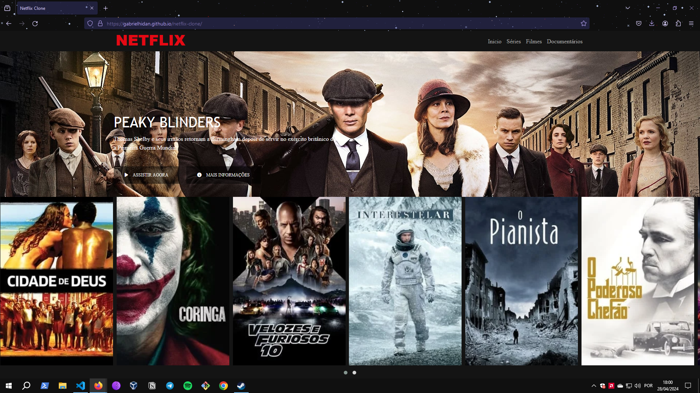
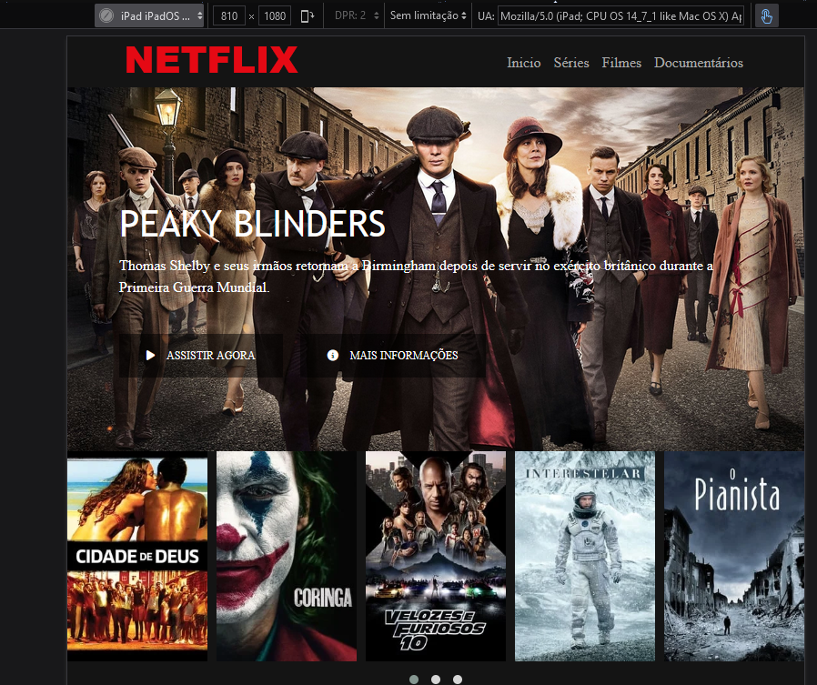
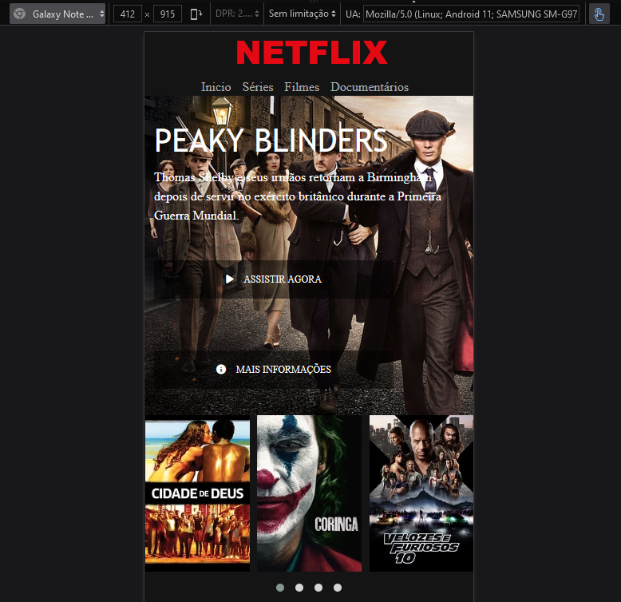

# Clone Netflix
#####

# [pt/br] ℹ️ Sobre:
## Neste Projeto eu Recriei a Interface da Netflix
### Site Totalmente Responsivo , acesse através do link <a href="https://gabrielhidan.github.io/netflix-clone/ " target="_blank"> Projeto</a>

### Projeto desenvolvido com HTML 5,  CSS 3, JavaScript Com o Uso da Biblioteca jQuery
#
# [en/us] ℹ️ About:
## In this Project I Recreated the Netflix Interface
### Fully Responsive Website, access via the link <a href="https://gabrielhidan.github.io/netflix-clone/ " target="_blank"> Project</a>

### Project developed with HTML 5, CSS 3, JavaScript Using the jQuery Library

#
   

##

##

